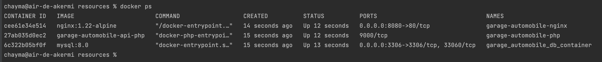

# GarageAutomobileAPI
## Installation
- Installer Docker: https://docs.docker.com/engine/install/
## Comment lancer le projet en local

- À la racine du projet:
  - Exécuter la command `docker network create apis` pour créer un pont de communication entre les conteneurs PHP, NGINX et MYSQL
  - Exécuter la commande `docker-compose up -d` pour créer les conteneurs
  - Exécuter la commande `docker ps` pour vérifier si on a bien les 3 conteneurs
  
    
  
  - Exécuter la commande `docker compose run php composer install` pour installer les librairies
  - Créer les tables 
    - Soit exécuter la commande `docker compose run php bin/console doctrine:schema:update --force` pour créer les tables à partir les entités
    - Soit exécuter la commande `docker compose run php bin/console doctrine:migrations:migrate` pour créer les tables à partir les migrations 
